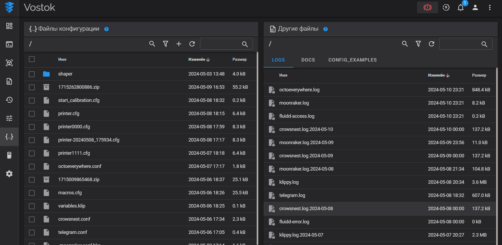
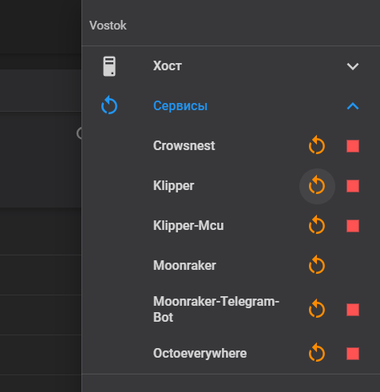
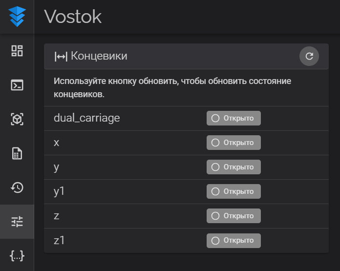

#Инструкция для конфигурации 
1. Создание первоначального конфига
2. Проверить концевики
2. Настроить направление осей
3. Настроить нулевую точку и область печати
4. Настройка скоростей и тока двигателей
5. Настройка ПИД
6. Калибровка уровня стола
6. Установка и настройка акселерометра

##Создание первоначального конфига
Основной целью на первом этапе является получения конфигурационного файла который не будет выдавать ошибки. 
Для этого в конфигураторе достаточно выбрать Адрес MCU, область печати по осям, включит второй экструдер в случае конфигурации idex и материнскую плату.

###Основы создания конфигурационного файла

Конфигурационный файл состоит из разделов, которые записываются в квадратных скобках `[]`, например `[stepper_x]`. 
Внутри них содержатся параметры, значения которых указаны через двоеточие. Текст, который следует после символа `#` является комментарием и не учитывается программой.
Для инверсии сигнального пина (например, для смены направления двигателя или концевика) устанавливается `!` перед адресом контакта. 
Посмотреть список разделов и параметров можно [тут](https://www.klipper3d.org/Config_Reference.html).
=== "Раздел"

    ```cfg title='print.cfg' hl_lines="6"
    ################################################################################
    #   X/Y Stepper Settings
    ################################################################################
    
    #Motor0
    [stepper_x]
    step_pin: PF13
    dir_pin: !PF12 # напрвление вращения
    enable_pin: !PF14
    rotation_distance: 20
    microsteps: 128
    full_steps_per_rotation: 200 # кол-во шагов на оборот. 1.8 градуса - 200, 0.9 градуса - 400
    endstop_pin: !PG6
    position_min: -0.01
    position_endstop: 0
    position_max: 500
    homing_speed: 20
    second_homing_speed: 5
    ```

=== "Параметр"

    ```cfg title='print.cfg' hl_lines="7"
    ################################################################################
    #   X/Y Stepper Settings
    ################################################################################
    
    #Motor0
    [stepper_x]
    step_pin: PF13
    dir_pin: !PF12 # напрвление вращения
    enable_pin: !PF14
    rotation_distance: 20
    microsteps: 128
    full_steps_per_rotation: 200 # кол-во шагов на оборот. 1.8 градуса - 200, 0.9 градуса - 400
    endstop_pin: !PG6
    position_min: -0.01
    position_endstop: 0
    position_max: 500
    homing_speed: 20
    second_homing_speed: 5
    ```

=== "Комментарий"

    ```cfg title='print.cfg' hl_lines="5"
    ################################################################################
    #   X/Y Stepper Settings
    ################################################################################
    
    #Motor0
    [stepper_x]
    step_pin: PF13
    dir_pin: !PF12 # напрвление вращения
    enable_pin: !PF14
    rotation_distance: 20
    microsteps: 128
    full_steps_per_rotation: 200 # кол-во шагов на оборот. 1.8 градуса - 200, 0.9 градуса - 400
    endstop_pin: !PG6
    position_min: -0.01
    position_endstop: 0
    position_max: 500
    homing_speed: 20
    second_homing_speed: 5
    ```
Используя раздел `include` добавляются дополнительный файлы конфигурации (программа считает их единым целым). 
Данный раздел используется без параметров, название файла `macros.cfg` который необходимо добавить указывается в самом название раздела.
```    cfg title='print.cfg' hl_lines="4"
    ################################################################################
    #   Included configs
    ################################################################################
    [include macros.cfg]        # Основные макросы
    #[include input_shaper.cfg]  # ADXL Input Shaping
    #[include leds.cfg]
    #[include fans.cfg]          # Вентилятор
    #[include idex.cfg]          # Смена печатающей головки
    [include misc.cfg]          # Разное
```
### Загрузка конфига в принтер
Для загрузки конфигурационного файла в принтер можно воспользоваться веб интерфейсом.



Основной файл должен называться `printer.cfg`, существующий файл можно переименовать или удалить.



После загрузки нового файла необходимо перезагрузить клиппер по кнопке со скриншота или нажать кнопку `перезагрузить прошивку`.

### Проверка концевиков
Необходимо передвинуть оси из домашних положений и проверить состояние концевиков, они должны быть в статусе `открыто`. 
Убедитесь что принтер видит срабатывание датчиков, для этого нажмите на концевик и обновите раздел.
В случае когда концевик работает, но показывает противоположные значения, необходимо инвертировать его пин в конфигурации.

### Настройка направления осей
Для определения направления осей передвиньте оси в центральное положение (на выключенном принтере) и запустите макрос `test_axis`.

### Настройка начала координат области печати
Для установки начала координат отправьте голову в домашнее положение и передвиньте в нулевую точку.

