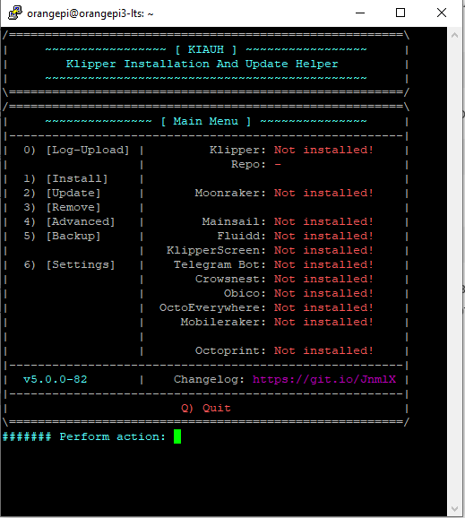
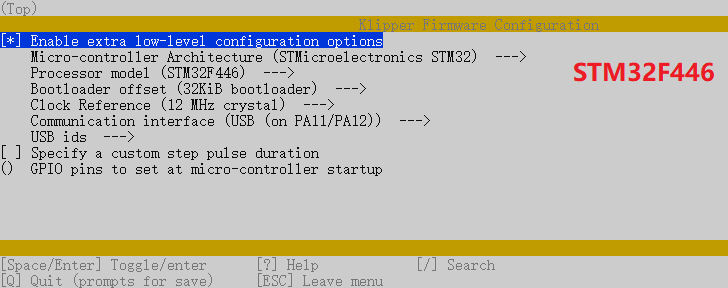
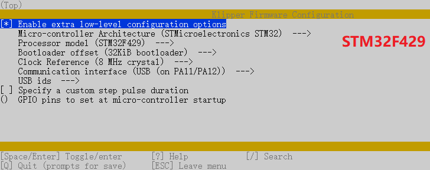
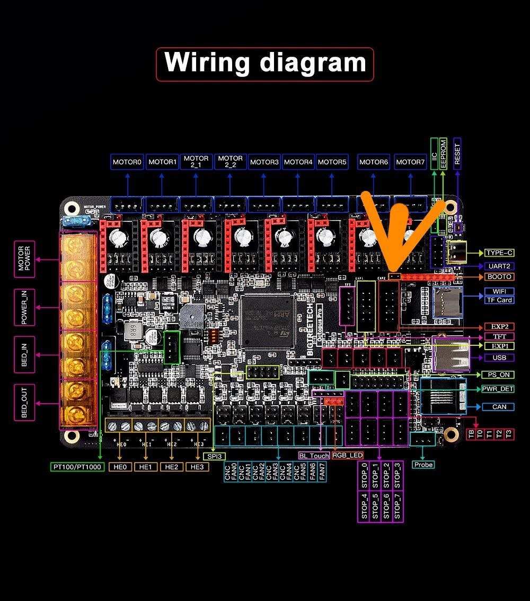

# Установка Klipper
Для упрощения установки клипера и других компонентов можно воспользоваться спецальным скриптом. 
## Установка KIAUH
KIAUH (Klipper Installation And Update Helper) - это скрипт, который помогает вам установить Klipper в операционную систему Linux. [GitHub](https://github.com/dw-0/kiauh)

!!! info

    Команды в заголовке которых указано `Linux` выполняются в консоле PuTTY, при указании `Klipper` выполняются через консоль веб интерфейса.

* Шаг 1:
Для загрузки скрипта, необходимо установить git. Если у вас еще не установлен git или вы не уверены, выполните следующую команду:
``` cmd title='Linux'
sudo apt-get update && sudo apt-get install git -y
```

* Шаг 2:
После установки git используйте следующую команду, для загрузки KIAUH в свой домашний каталог:
``` cmd title='Linux'
cd ~ && git clone https://github.com/dw-0/kiauh.git
```

* Шаг 3:
Затем, запустите KIAUH, выполнив следующую команду:
``` cmd title='Linux'
./kiauh/kiauh.sh
```

* Шаг 4:
Вам откроется главное меню KIAUH. 


??? question "Взаимодействие с интерфейсом KIAUH"
    
    На главной странице в левом столбце находять возможные действия:

    0. Log-Upload — Журнал
    1. Instal     — Установка компанентов
    2. Update     — Обновление компонентов
    3. Remove     — Удаление компонентов
    4. Advenced   — Продвинутые компоненты
    5. Backup     — Резернвные копии
    6. Setting    — Настройки
    
    В правом столбе указаны компоненнты и их текущий статус. В нижней части указана команда для выхода `q`.
    Для выбора необходимого действия, введите соответствующий номер в консоль и подтвердите нажатием ENTER.
## Установка компонентов через KIAUH
Основные компоненты для установки:

* Klipper
* Moonraker
* Fluidd
* G-Code Shell Command (находится в разделе Advanced)

!!! info
    
    Во время установки скрипт будет задавать дополнительные вопросы, ответом является число (в некоторых случаях уже выбран основной вариант) или буква `y` согласиться.

Дополнительные компоненты устанавливаются по желанию и не являются обязательными.


## Конфигурация и установка прошивки для материнской платы

### Конфигурация прошивки
Выполняем в консоли следующие команды:
``` cmd title='Linux'
cd ~/klipper
make clean
make menuconfig 
```


В структуре меню необходимо выбрать ряд пунктов (В примере платы Octopus).

* Выберите `Enable extra low-level configuration options`.
* В `micro-controller architecture` установите `STMicroelectronics STM32`
* В `Processor model` выберите `STM32F446` или `STM32F429` (зависит от микроконтроллера вашей материнской платы)
* В `Bootloader offset` установите `32KiB bootloader`
* В `Clock Reference` выберите `12 MHz crystal` (для STM32F446) или `8 MHz crystal` (для STM32F429)
* В `Communication interface` установите `USB (on PA11/PA12)` (примечание: если вы собираетесь использовать UART вместо USB, то читайте документацию [BigTreeTech](https://github.com/bigtreetech/BIGTREETECH-OCTOPUS-V1.0/tree/master/Octopus%20works%20on%20Voron%20v2.4/Firmware/Klipper))





Нажимаем `Q`, сохраняя внесенные изменения и компилируем прошивку:


``` cmd title='Linux'
make
```
Если все прошло успешно, putty в консоли сообщит:

```
Version: v0.12.0-180-g79930ed9
  Preprocessing out/src/generic/armcm_link.ld
  Linking out/klipper.elf
  Creating hex file out/klipper.bin
```

Это означает что прошивка скомпилировалась и находится по адресу `/home/pi/klipper/out/klipper.bin`


### Установка прошивки

Существует несколько вариантов прошивки материнской платы Octopus.
=== "Установка прошивки с использованием SD-карты"

    * Работает независимо от подключения по USB или UART
    * Необходима microSD карта
    
    Переименуем файл в firmware.bin выполнив команды: 
    ``` cmd title='Linux'
    cd ~/klipper
    mv out/klipper.bin out/firmware.bin
    ```
    
    Важно: Если файл не переименован, прошивка не обновится. Загрузчик ищет файл с именем `firmware.bin`.
    
    Запускаем [FileZilla](https://www.filezilla.ru/get/), подключаемся к управляющей плате, скачиваем `firmware.bin` (полный путь: `/home/pi/klipper/out/firmware.bin`).
    ??? question "Подключение к управляющей плате"

        Введите ip адрес, логин и пароль от linux и порт в верхней части экрана.

    * Форматируем microSD карту в формате FAT32
    * Копируем `firmware.bin` на microSD
    * Установливаем microSD и перезагружаем материнскую плату
    * Через несколько секунд Octopus должен быть прошит

=== "Установка прошивки через DFU (без SD-карты)"
    
    * Требуется USB-подключение
      * Требуется установка дополнительной перемычки на Octopus
      * НЕ требует SD-карты
    
    
    * Шаг 1: Отключаем питание материнской платы
      * Шаг 2: Устанавливаем перемычку BOOT0
      
      * Подключаем материнскую к управляющей плате
      * Подключаем питание материнской платы
      * Шаг 3: Находим идентификатор устройства. Обычно устройство называется `STM Device in DFU mode`.
    ``` cmd title='Linux'
    cd ~/klipper
    lsusb
    ```
    Пример вывода:
    ``` hl_lines="4"
    Bus 002 Device 001: ID 1d6b:0003 Linux Foundation 3.0 root hub
    Bus 001 Device 005: ID 1b3f:2247 Generalplus Technology Inc. GENERAL WEBCAM
    Bus 001 Device 014: ID 1bcf:2286 Sunplus Innovation Technology Inc. FHD Camera
    Bus 001 Device 034: ID 0483:df11 STMicroelectronics STM Device in DFU Mode
    Bus 001 Device 002: ID 2109:3431 VIA Labs, Inc. Hub
    Bus 001 Device 001: ID 1d6b:0002 Linux Foundation 2.0 root hub

    ```
    пример без перемычки boot
    ``` hl_lines="4"
    Bus 002 Device 001: ID 1d6b:0003 Linux Foundation 3.0 root hub
    Bus 001 Device 005: ID 1b3f:2247 Generalplus Technology Inc. GENERAL WEBCAM
    Bus 001 Device 014: ID 1bcf:2286 Sunplus Innovation Technology Inc. FHD Camera
    Bus 001 Device 037: ID 1d50:614e OpenMoko, Inc. stm32f429xx
    Bus 001 Device 002: ID 2109:3431 VIA Labs, Inc. Hub
    Bus 001 Device 001: ID 1d6b:0002 Linux Foundation 2.0 root hub

    ```
    
    !!! question
        
        Если вы не видите устройство DFU в списке, нажмите кнопку `Reset` рядом с разъемом USB и запустите `lsusb` еще раз.
    * Шаг 4: Введите `make flash FLASH_DEVICE=1234:5678`, заменив `1234: 5678` идентификатором из предыдущего шага. Обратите внимание, что идентификатор представлен в шестнадцатеричной форме; он содержит только цифры `0-9` и буквы `A-F`.
    ??? question "Error 255"

        Проверте через веб интерфейс возможно прошивка установлена и нужно снять перемычку для дальнейшей работы
        ``` 
        File downloaded successfully
        Submitting leave request...
        Transitioning to dfuMANIFEST state
        dfu-util: can't detach
        Resetting USB to switch back to Run-Time mode
        
        Failed to flash to 0483:df11: Error running dfu-util
        
        If the device is already in bootloader mode it can be flashed with the
        following command:
          make flash FLASH_DEVICE=0483:df11
          OR
          make flash FLASH_DEVICE=1209:beba
        
        If attempting to flash via 3.3V serial, then use:
          make serialflash FLASH_DEVICE=0483:df11
        
        make: *** [src/stm32/Makefile:111: flash] Error 255
        ```

    * Шаг 5: Отключаем питание материнской платы и снимаем перемычку BOOT
    * Включаем питание материнской платы

Вводим команду для определения адреса платы. Данный адрес в дальнейшем указывается в разделе `mcu` конфигурационного файла klipper, сохраните его.
``` cmd title='Linux'
ls /dev/serial/by-id
```
!!! info

    Данный метод работает только с прошивками скомпилироваными для USB, а не для UART

Пример вывода консоли:

``` hl_lines="2"
pi@vostok:/ $ ls /dev/serial/by-id
usb-Klipper_stm32f429xx_3F0039000950314B33323220-if00

```

Пример раздела конфигурационного файла (необходимо указать свой адрес полученный выше):
``` cfg title='printer.cfg'
[mcu]
serial: /dev/serial/by-id/usb-Klipper_stm32f429xx_3F0039000950314B33323220-if00
```
!!! warning

    Если Octopus не подключен к питанию 12-24В, Klipper не сможет взаимодействовать с драйверами TMC через UART, и Octopus автоматически отключится.

Переходим к конфигурации Klipper и установке дополнительной периферии.

