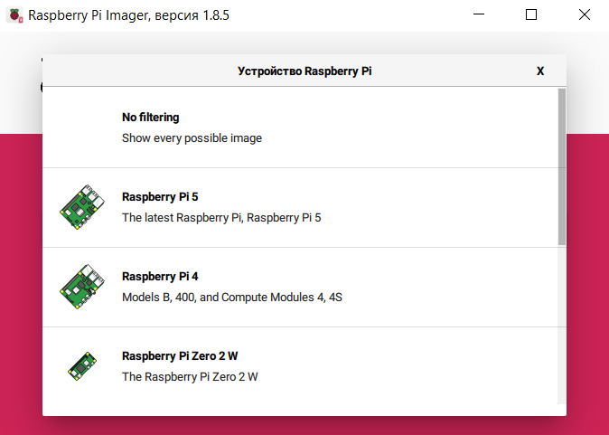

# Установка операционной системы Linux
Установка может отличаться от выбранной управляющей платы. Наиболее простой вариант установки для Raspberry.
!!! info

    Команды в заголовке которых указано `Linux` выполняются в консоле PuTTY, при указании `Klipper` выполняются через консоль веб интерфейса.

## Запись образа
=== "Raspberry Pi"

    Raspberry Pi OS Lite (32bit или 64bit) это рекомендуемый образ Linux, если вы используете Raspberry Pi. [Raspberry Pi Imager](https://www.raspberrypi.com/software/) — самый простой способ загрузить образ на SD-карту.
    
    * После загрузки, установки и запуска [Raspberry Pi Imager](https://www.raspberrypi.com/software/) откроется основное окно программы в котором нужно выбрать необходимые настройки для создания образа ОС:
    
    
    
    
    * Выберете плату на которую необходимо установить ОС:
    
    
    
    
    * Затем выберете необходимую версию `ОС Raspberry Pi OS Lite (32bit)` (или 64-битный, если вы хотите использовать его вместо этого)   `Выбрать ОС -> Raspberry Pi OS (other) -> Raspberry Pi OS Lite (32bit)`:
    
    
    
    
    
    * Вернувшись в главное меню Raspberry Pi Imager, выберите соответствующую SD-карту, на которую вы хотите записать образ.
    
    
    
    * На данном этапе должны быть заполнены все поля, переходим далее:
    
    
    
    * Настраиваем дополнительные параметры образа:
    !!! info
        Cтандартный логин для плат raspberry: `pi`, пароль: `raspberry`. Рекумендуется оставлять логин стандартным для упрощения дальнейшей работы.
    
    
    
    * Обязательно зайдите в расширенную опцию и включите SSH и настройте Wi-Fi.
    
    
    
    
    
    * Установите SD карту в Raspberry и подключите питание, начнется процесс установки.
    
    
    Если вам нужна дополнительная помощь по использованию Raspberry Pi Imager, пожалуйста, ознакомьтесь с официальной [документацией](https://www.raspberrypi.com/software/).
    
    
    
    
=== "Orange Pi"

    !!! warning
        Раздел находится в разработке
    Имя пользователя рекомендуется `pi` для унификации инструкции по установки
    ПО для Windows:
    
    * Программа для создания загрузочных дисков (например Rufus)
    * Текстовый редактор (например: Блокнот, Notepad++ или VSCode)
  

## Подключение к управляющей плате
Наиболее популярным вариантом подключения к управляющей плате по SSH (Secure Shell — «безопасная оболочка») является [Putty](https://putty.org.ru/download).
Для взаимодействия с файлами управляющей платы используем [FileZilla](https://www.filezilla.ru/get/).
IP адрес можно узнать через настройки роутера или через [Advanced IP Scanner](https://www.advanced-ip-scanner.com/ru/).

### Определение IP адреса
Запускаем сканирование через Advanced IP Scanner

### Подключение по SSH через Putty
Запускаем Putty. Вводим IP адрес, желаемое имя сессии (можно использовать название принтера) и сохраняем.

Открываем SSH сессию. При первом подключении будет уведомление безопасности, принимаем его кнопкой `Accept`.

Входим в учетную запись Linux, стандартный логин для плат raspberry: `pi`, пароль: `raspberry` (Пароль при вводе не отображается).

!!! info
    
    Текст из буфера обмена в putty вставляется правой кнопкой мыши, копируется `Ctrl + Shift + C`

## Настройка Linux
Выдача необходимых прав пользователя Linux ???
