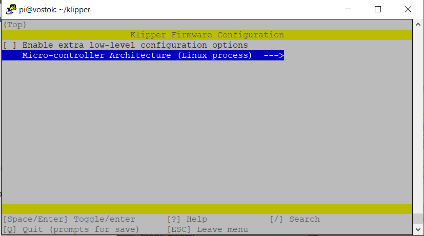
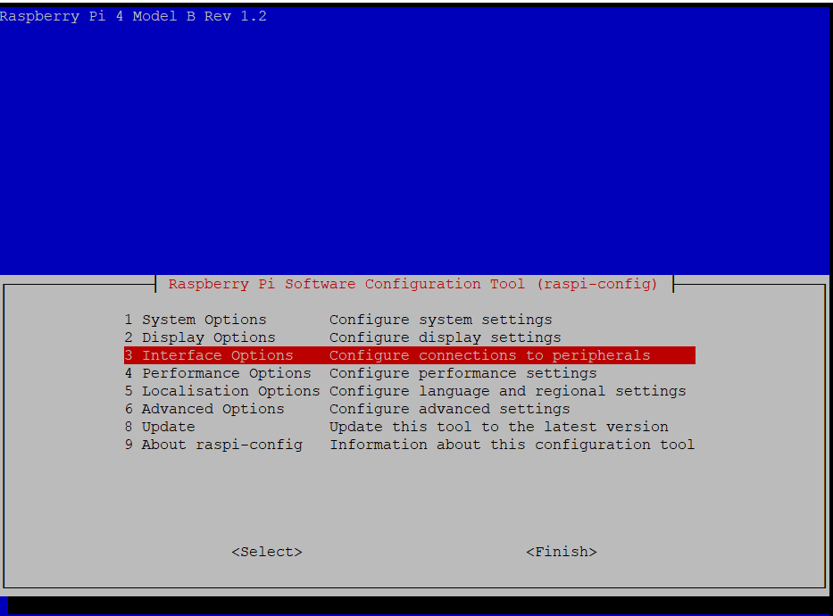
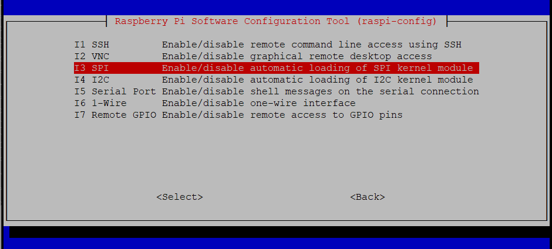
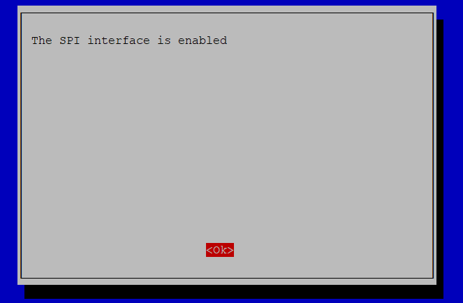

# Установка акселерометра по SPI
!!! info

    Команды в заголовке которых указано `Linux` выполняются в консоле PuTTY, при указании `Klipper` выполняются через консоль веб интерфейса.

## Настройка Raspberry

Для использования GPIO портов и шин i2c, spi управляющей платы необходима дополнительная настройка.

Копируем скрипт командой
```cmd title='Linux'
cd ~/klipper/
sudo cp ./scripts/klipper-mcu.service /etc/systemd/system/
sudo systemctl enable klipper-mcu.service
```
Запускаем меню конфигурации для Управляющей платы
```cmd title='Linux'
cd ~/klipper/
make menuconfig
```

В появившемся меню для параметра `Microcontroller Architecture` устанавливаем `Linux process` 


Выходим и сохраняем `Q`

Затем устанавливаем скомпилированный код
```cmd title='Linux'
sudo service klipper stop
make flash
sudo service klipper start
```


### Активируем интерфейс SPI
Шина SPI используется для подключения акселерометра

* Запускаем конфигуратор управляющей платы
```cmd title='Linux'
sudo raspi-config
```
* Переходим в раздел `Interface Options`



* Выбираем интерфейс `SPI`



* Соглашаемся с активацией 



* Выходим


## Подключение акселерометра по SPI


Устанавливаем необходимые библиотеки
```cmd title='Linux'
~/klippy-env/bin/pip install -v numpy
```
Устанавливаем дополнительные зависимости
```cmd title='Linux'
sudo apt update
sudo apt install python3-numpy python3-matplotlib libatlas-base-dev libopenblas-dev
```


Добавляем в `print.cfg`

```cfg title='print.cfg'
[mcu rpi]
serial: /tmp/klipper_host_mcu

[adxl345]
cs_pin: rpi:None
axes_map: x,y,-z #Порядок осей для красивого графика

[resonance_tester]
accel_chip: adxl345
probe_points:
    200, 125, 50  # Точка для тестирования резонансов (центр стола)

```

Схемы подключения некоторых плат ADXL345:


Рекомендуемая схема подключения:

| ADXL345 пин   | RasbberryPi пин | название пина RasbberryPi |
|:--------------|:----------------|:--------------------------|
| 3V3 (or VCC)	 | 01	             | 3V3                       |
| GND           | 06              | GND                       |
| CS	           | 24              | GPIO08 (SPI0_CE0_N)       |
| SDO	          | 21	             | GPIO09 (SPI0_MISO)        |
| SDA	          | 19	             | GPIO10 (SPI0_MOSI)        |                
| SCL	          | 23	             | GPIO11 (SPI0_SCLK)        |

## Проверка акселерометра
Для проверки работы акселерометра можно получить его текущие значения. Для это нужно запустить команду `ACCELEROMETER_QUERY [CHIP=<config_name>]` в консоли веб интерфейса. Для стандартного названия акселерометра запустите
``` title='Klipper'
ACCELEROMETER_QUERY
```
Измерить шум датчиков можно командой `MEASURE_AXES_NOISE` нормальными считаются значения до 100.

