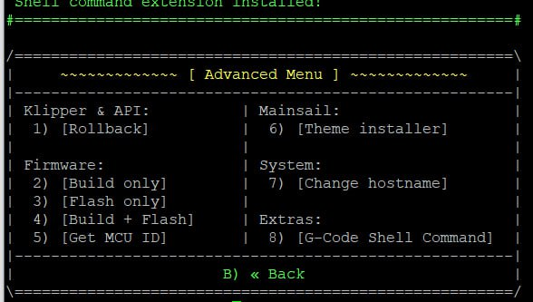

# Измерение резонансов

## Установка G-Code Shell Command
Для отображения результатов измерения в веб интерфейсе необходимо установить дополнительный модуль через KIAUH.

!!! info

    Команды в заголовке которых указано `Linux` выполняются в консоле PuTTY, при указании `Klipper` выполняются через консоль веб интерфейса.
!!! warning

    Если KIAUH ранее не был установлен, ознакомтесь с [инструкцией](https://toshik13.github.io/3D/klipper/).

Запустите KIAUH, выполнив следующую команду:
``` cmd title='Linux'
./kiauh/kiauh.sh
```

Перейдите в раздел 4 `Advenced`



Запустите процесс установки 8 `G-Code Shell Command`


## Добавление макроса и скрипта в конфигурационный файл

<a href="/3D/shaper pi.zip" download="shaper pi.zip">Скачать архив для пользователя pi</a>

<a href="/3D/shaper klipper.zip" download="shaper klipper.zip">Скачать архив для пользователя klipper</a>

!!! warning

    В случае если имя пользователя Linux отличаетя от `pi` или `klipper` необходимо будет изменить адрес в файлах.

Добавьте в папку с конфигурацией папку `shaper` в которой должны находится файл макроса `ADXL_SHAPER.cfg` и файл скрипта `adxl_shape.sh`


Добавьте строку `[include shaper/ADXL_SHAPER.cfg]` в `print.cfg` для работы макроса


## Использование


Для измерения резонансов запустите макрос через веб интерфейс или консоль
``` cmd title='Klipper'
ADXL_SHAPE
```
??? info "Параметры"
    
    NAME - указывается название для конкретного теста

    AXIS - xy, x, y выбор тестируемых осей

    TOOLS - 01, 0, 1 номер тестируемой головы

    MODS - s, c, m режим тестирования: одиночный режим, режим копии, режим зеркала

После измерения и создания графиков, они будут находиться в папке shaper